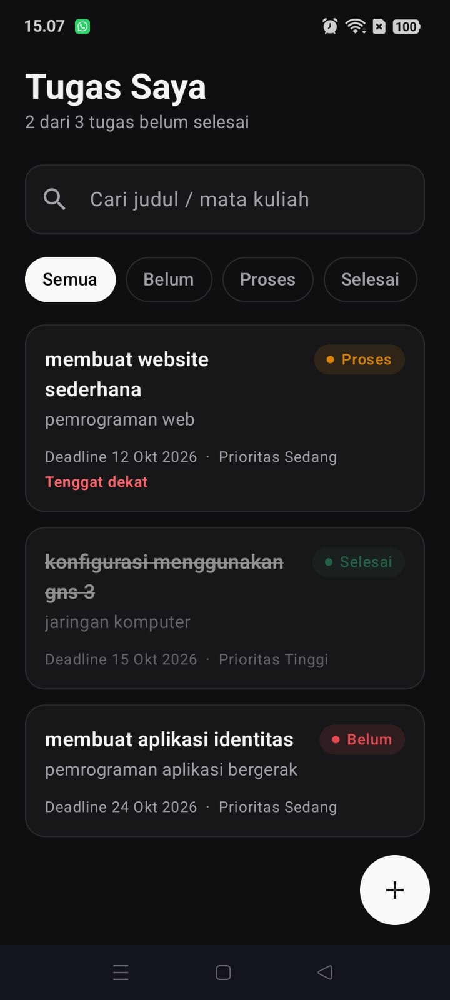
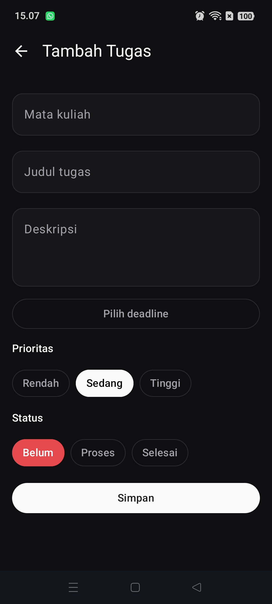
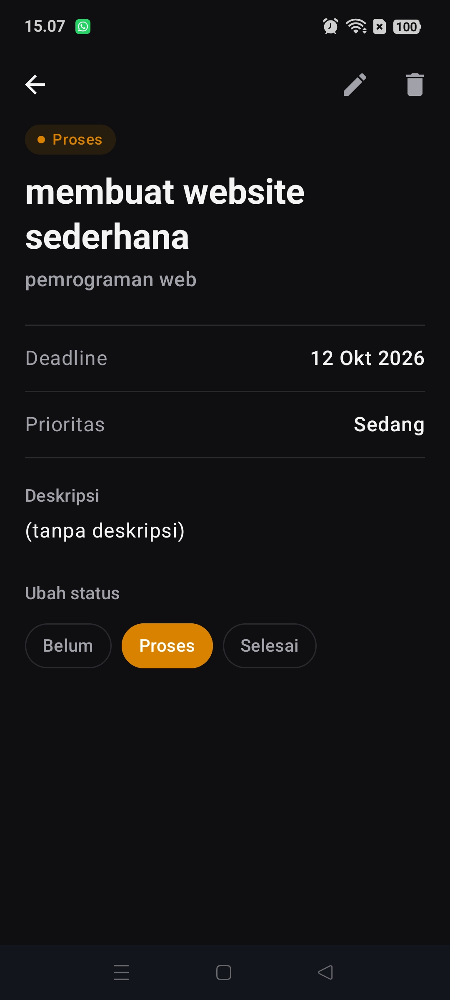
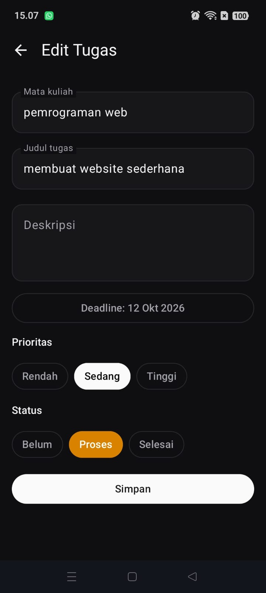

# TaskManager

Aplikasi Android untuk membantu mahasiswa mengelola tugas kuliah.

## Fitur
- Menambah, mengedit, dan menghapus tugas.
- Melihat detail tugas.
- Mengatur deadline, prioritas, dan status tugas.
- Mencari dan memfilter tugas.
- Menyimpan data secara lokal menggunakan Room Database.

## Teknologi
- Kotlin
- Jetpack Compose
- Room Database
- ViewModel
- Navigation Compose

## Screenshot

### Daftar Tugas

### Tambah Tugas

### Detail Tugas

### Edit Tugas

## Identitas
- Nama: Rifaldo Ikhwan Nanda
- NIM: 2411026
- Program Studi: S1 Informatika
- Universitas: Universitas Mulia Balikpapan
